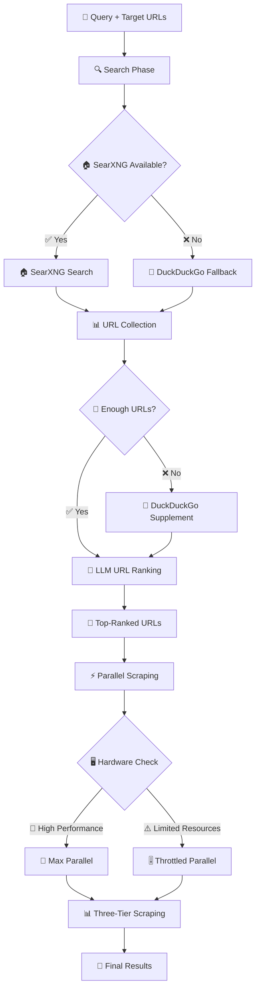

# 🔍 Enhanced Intelligent Search & Scrape System

A sophisticated, multi-tier web scraping and content extraction system with intelligent fallbacks, LLM-powered ranking, and adaptive parallel processing.

## 🏗️ System Architecture



## 🔄 Three-Tier Scraping Strategy

### Tier 1: BeautifulSoup (Primary)
- **Fast & Reliable**: Lightweight HTTP requests with HTML parsing
- **Universal Compatibility**: Works on all websites
- **Clean Text Extraction**: Removes HTML tags, scripts, navigation elements
- **Success Rate**: ~90% for most content

### Tier 2: Crawl4AI HTTP-Only (Enhanced)
- **Intelligent Triggers**: Activated for beneficial domains or poor content quality
- **Advanced Extraction**: Better handling of dynamic content
- **Clean Text Pipeline**: BeautifulSoup integration for HTML cleaning
- **Timeout & Retry Logic**: Robust connection handling
- **Target Domains**: News sites (CNN, BBC), academic sites (arXiv), complex sites

### Tier 3: Playwright (Future/Fallback)
- **JavaScript Rendering**: For SPA and dynamic content
- **Ultimate Fallback**: When all else fails
- **Resource Intensive**: Used sparingly due to performance impact

## 🔧 Key Components

### 1. Search Engine Integration
**File**: `utils/search/search_engine.py`

```python
# Multi-engine search with intelligent fallbacks
SearXNG (Primary) → DuckDuckGo (Fallback) → URL Collection
```

**Features**:
- Local SearXNG integration for privacy and speed
- DuckDuckGo API fallback for reliability
- URL deduplication and cleaning
- Configurable result multipliers

### 2. LLM-Powered URL Ranking
**File**: `utils/search/llm_ranker.py`

```python
# Groq LLaMA 3.3 70B model for intelligent ranking
Raw URLs → Relevance Analysis → Quality Scoring → Top Results
```

**Features**:
- Content relevance scoring (0-100)
- Domain authority consideration
- Query-specific optimization
- Batch processing for efficiency

### 3. Intelligent Scraper
**File**: `utils/search/scraper.py`

```python
# Adaptive scraping with method selection
URL Analysis → Method Selection → Content Extraction → Quality Validation
```

**Features**:
- Automatic method selection based on URL and content
- Parallel processing with hardware-aware throttling
- Graceful fallbacks between scraping tiers
- Content quality validation

### 4. Crawl4AI Integration
**File**: `utils/search/crawl4ai_scraper.py`

```python
# Advanced extraction with HTTP-only strategy
AsyncWebCrawler → HTTP Strategy → Content Extraction → HTML Cleaning
```

**Features**:
- Windows-compatible HTTP-only mode
- Increased timeout handling (45s)
- Retry logic with exponential backoff
- BeautifulSoup HTML cleaning integration

## ⚡ Performance Features

### Parallel Processing
- **Hardware Detection**: CPU cores and memory analysis
- **Dynamic Throttling**: Adjusts parallel operations based on system resources
- **Async/Await Pattern**: True concurrent execution with `asyncio.gather()`
- **Connection Pooling**: Efficient HTTP request management

### Quality Assurance
- **Content Validation**: Word count and quality thresholds
- **Method Performance Tracking**: Success rates and performance metrics
- **Fallback Logic**: Automatic tier switching on failures
- **Error Handling**: Graceful degradation and retry mechanisms

## 📊 System Requirements

### Minimum Requirements
- **Python**: 3.8+
- **Memory**: 2GB RAM
- **CPU**: 2 cores
- **Network**: Stable internet connection

### Recommended Setup
- **Python**: 3.11+
- **Memory**: 8GB RAM
- **CPU**: 4+ cores
- **SearXNG**: Local instance for optimal performance

### Dependencies
```bash
# Core dependencies
pip install beautifulsoup4 lxml requests aiohttp
pip install crawl4ai groq python-dotenv psutil

# Optional (for advanced features)
pip install playwright  # For Tier 3 scraping
```

## 🚀 Quick Start

### 1. Environment Setup
```bash
# Clone and setup
git clone <repository>
cd app2

# Install dependencies
pip install -r requirements.txt

# Configure environment
cp .env.example .env
# Add your GROQ_API_KEY
```

### 2. Basic Usage
```python
from main import enhanced_search_and_scrape_api

# Simple search
results = await enhanced_search_and_scrape_api(
    query="machine learning tutorials",
    num_results=5,
    url_multiplier=10
)
```

### 3. Run Demo
```bash
python main.py
```

## 🔧 Configuration

### Search Configuration
```python
SEARXNG_URL = "http://localhost:8888/search"  # Local SearXNG
GROQ_API_KEY = "your_groq_key_here"          # LLM ranking
MAX_PARALLEL_REQUESTS = 8                     # Hardware-based
```

### Scraping Thresholds
```python
CRAWL4AI_DOMAINS = {
    'cnn.com', 'bbc.com', 'arxiv.org',      # Beneficial domains
    'medium.com', 'stackoverflow.com'        # Complex sites
}

QUALITY_THRESHOLDS = {
    'min_words': 10,                         # Minimum content
    'crawl4ai_trigger': 50                   # BeautifulSoup fallback
}
```

## 📈 Performance Metrics

### Typical Results
- **Search Speed**: 2-5 seconds for URL collection
- **Scraping Speed**: 1-3 seconds per URL (parallel)
- **Success Rate**: 85-95% depending on target sites
- **Content Quality**: 500-3000+ words per result

### Method Performance
- **BeautifulSoup**: Fast, universal compatibility
- **Crawl4AI**: Enhanced extraction for complex sites
- **Mixed Strategy**: Optimal balance of speed and quality

## 🔍 Intelligent Triggers

### Crawl4AI Activation
1. **Beneficial Domains**: Pre-configured high-value sites
2. **Low Word Count**: < 50 words from BeautifulSoup
3. **Messy Content**: Navigation/advertisement pollution detected
4. **Quality Indicators**: Poor content structure patterns

### Hardware Adaptation
1. **CPU Analysis**: Adjusts parallel operations
2. **Memory Monitoring**: Prevents resource exhaustion
3. **Performance Tracking**: Real-time optimization
4. **Graceful Degradation**: Maintains functionality under load

## 🛠️ Troubleshooting

### Common Issues

**SearXNG Connection Failed**
```bash
# Check SearXNG status
curl http://localhost:8888/search?q=test

# Start SearXNG if needed
docker-compose up searxng
```

**Crawl4AI Timeouts**
- Increased timeout to 45 seconds
- Retry logic with exponential backoff
- Automatic fallback to BeautifulSoup

**Low Success Rate**
- Check network connectivity
- Verify target site accessibility
- Review error logs for patterns

### Debug Mode
```python
# Enable verbose logging
python main.py --debug

# Test specific URLs
python test_cnn_timeout.py
```

## 📚 API Reference

### Main Function
```python
async def enhanced_search_and_scrape_api(
    query: str,
    num_results: int = 3,
    url_multiplier: int = 10
) -> List[Dict]
```

### Response Format
```json
{
    "success": true,
    "title": "Article Title",
    "content": "Clean extracted text...",
    "method": "Crawl4AI-HTTP",
    "word_count": 1500,
    "quality_score": 95,
    "url": "https://example.com/article",
    "llm_relevance": 98
}
```

## 🔮 Future Enhancements

### Planned Features
- **Caching System**: Redis-based result caching
- **Content Classification**: ML-based content categorization
- **API Rate Limiting**: Request throttling and quotas
- **Multi-language Support**: International content extraction
- **Real-time Monitoring**: Performance dashboards

### Scalability
- **Docker Integration**: Containerized deployment
- **Load Balancing**: Multiple scraper instances
- **Database Integration**: Persistent result storage
- **Message Queues**: Async job processing

## 📄 License

MIT License - See LICENSE file for details

## 🤝 Contributing

1. Fork the repository
2. Create feature branch (`git checkout -b feature/enhancement`)
3. Commit changes (`git commit -am 'Add enhancement'`)
4. Push to branch (`git push origin feature/enhancement`)
5. Create Pull Request

---

**Built with ❤️ for intelligent web scraping and content extraction**  